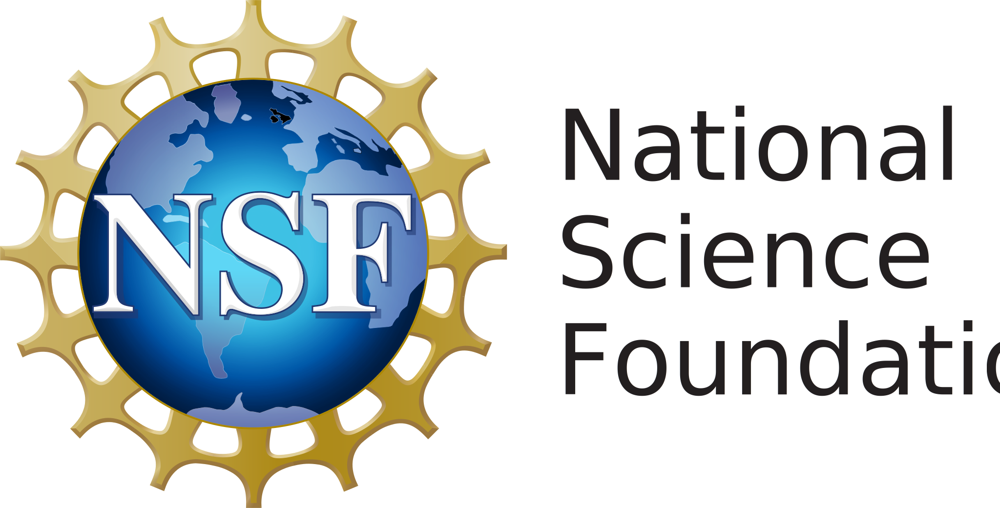

---
---

<!-- # We enhance Robotics and AI -->
##### Welcome to the Trustworthy Autonomous Systems Laboratory at the University of California, Riverside!

## Highlights

The ultimate goal of our research is to enable **trustworthy**, **interactive**, and **human-centered** autonomous embodied agents that can perceive, understand, and reason about the physical world; safely interact and collaborate with humans; and efficiently coordinate with other intelligent agents so that they can benefit society in daily lives. To accomplish this goal, our team has been pursuing 
interdisciplinary research that develops <em>fundamental theories</em> and <em>practical algorithms</em> grounded in robotics, machine learning, reinforcement learning, computer vision, control theory, and optimization, which are validated on various <em>robotic hardware platforms</em> such as humanoid mobile manipulators, quadrupeds, autonomous vehicles, manipulators, and drones. 









  

    
    

      Single-Robot Social Navigation
    

  

  

    
    

      Multi-Robot Cooperative Social Navigation
    

  

  

    
    

      Multi-Robot Cooperative Object Goal Navigation
    

  

  

    
    

      Single-Robot Human Following
    

  

  

    
    

      Long-Horizon Robotic Manipulation
    

  

  

    
    

      Personalized Autonomous Driving
    

  

<!-- 

  
  
  
  
  
  

 -->



This lab is directed by [Prof. Jiachen Li](https://profiles.ucr.edu/app/home/profile/jiachenl). Lab members consist of students with backgrounds in engineering, computer science, and mathematics. Our lab is actively seeking multiple highly motivated talents to join us as Ph.D. students (fully funded), master/undergraduate students, onsite/remote research interns (outside of UC Riverside), visiting scholars, or postdoctoral researchers. If you are interested in joining us, please follow the application instructions on the [Join Us](./join/) page.








###### We gratefully acknowledge the supports from:

  
  
  

